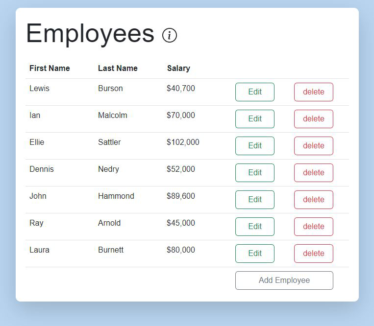
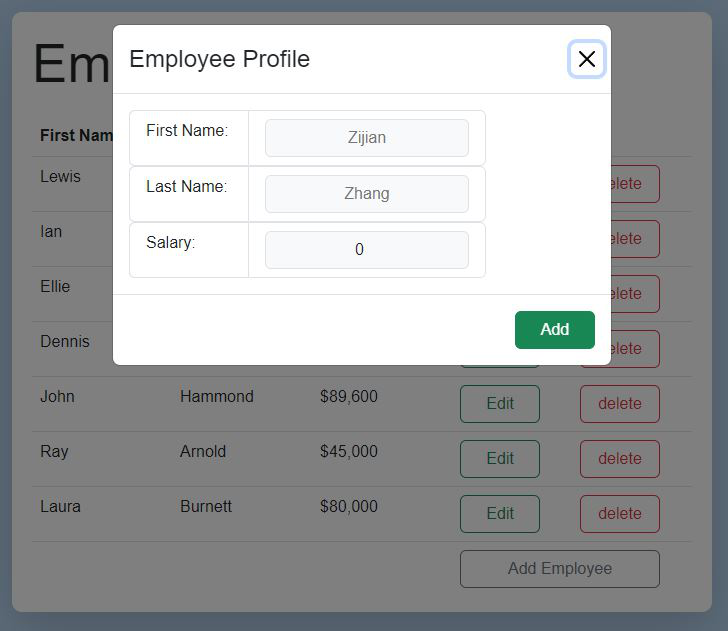

# Take-home Assignment (Full Stack) #
* Choice of stack is Angular front-end, .NET framwork back-end, and MSSQL Server for DB

### Setup guide: ###
* Clone reposioty to local
* Open EmployeeAPI as project/solution in Visual Studio 
* There are two ways to initialize the DB
  * by running `dotnet ng database update`, which triggers the db migration to create the DB with table and information
  * by running the sql script EmployeeDB_creation.sql
* after database creation, run the EmployeeAPI, Swagger UI should show up and all CRUD API methods could be tested
* Open EmployeesFrontEnd in Visual Studio code
  * Run `npm i` , then `ng serve` to start the web server
  * Navigate to http://localhost:4200/ for the application

### Exteral packages ###
All exteral packages list:
* Back-end
  * Microsoft.EntityFrameworkCore
  * Microsoft.EntityFrameworkCore.Design
  * Microsoft.EntityFrameworkCore.Tools
  * Microsoft.EntityFrameworkCore.sqlserver
  * Dotnet entity framework
* Front-end
  * Bootstrap
  * Bootstrap widgets
  * Angular bootstrap icons

### Result Image ###
* Application UI

* Edit/creation window

### Goal: ###
* Create an Employee Table like the one in the image below.
* Use any front-end framework (Angular, React, Vue, ect...) or CSS library to accomplish this.
* Implement the back-end API with the back-end framework of your choice, and a SQL database

### Functional Requirements: ###
* Initially, list all employees that are in data.json
  * First name, last name, and salary in currency format (ie. $42,000)
* The ability to edit an employee
* The ability to delete an employee
* The ability to create a new employee

### Technical Guidelines: ###
* Structure your application and components in a modular/reusable way
* Commit code with useful and informative comments
* Your application doesn't have to use the data.json file directly, but have a SQL script to initialize your database with data found in that file
* Implement API code to read and write to a SQL database
* Styling: CSS or SCSS or SASS can be used, whichever you prefer (can use popular UI frameworks like Bootstrap as well)

### Questions? ###
Please reach out to me with any questions
